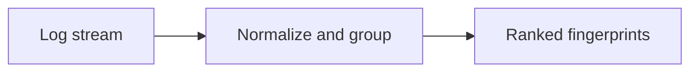

<!-- readme-refresh:start -->
<p align="center">
  <picture>
    <source media="(prefers-color-scheme: dark)" srcset="assets/readme-banner.png">
    <source media="(prefers-color-scheme: light)" srcset="assets/readme-banner.png">
    
  </picture>
</p>

<h1 align="center">🌾 LogHarvest</h1>

<p align="center"><strong>Condense noisy logs into ranked, stable error fingerprints.</strong></p>

<p align="center">
  <a href="https://github.com/al1re3a/logharvest/actions/workflows/ci.yml"></a>
  <a href="https://www.python.org/"></a>
  <a href="LICENSE"></a>
  <a href="https://github.com/al1re3a/logharvest/stargazers"></a>
  <a href="https://github.com/al1re3a/logharvest/issues"></a>
</p>

<p align="center">
  <a href="https://github.com/al1re3a/logharvest"></a>
  <a href="#examples"></a>
  <a href="CONTRIBUTING.md"></a>
  <a href="SECURITY.md"></a>
</p>

<p align="center">
  
</p>

> [!NOTE]
> Fingerprint normalization is designed for triage. Keep the original logs when exact values or full event order matter.

## 📑 Contents

- [At a glance](#-at-a-glance)
- [Features](#features)
- [Examples](#examples)
- [Philosophy](#philosophy)
- [Development](#development)

---

## 🔎 At a glance

| | |
|---|---|
| **Purpose** | Turn noisy logs into ranked, stable error fingerprints — dependency-free Python CLI for incident triage. |
| **Input** | Log stream |
| **Output** | Ranked fingerprints |
| **Runtime** | Python 3.10+ |
| **CI** | ✅ Linux · Windows |
| **Status** | ✅ Maintained |

<details>
<summary><strong>🧭 How it works</strong></summary>



</details>

<details>
<summary><strong>📁 Repository layout</strong></summary>

```text
logharvest/
├── .github/
├── src/
├── tests/
├── examples/
├── pyproject.toml
└── README.md
```

</details>

<details>
<summary><strong>🤝 Contributors</strong></summary>

<br>
<a href="https://github.com/al1re3a/logharvest/graphs/contributors">
  
</a>

</details>
<!-- readme-refresh:end -->

**Turn 100,000 noisy log lines into the five failures that matter.**

LogHarvest is a dependency-free Python CLI that detects error events, keeps useful stack context, removes volatile values, and groups repeated failures under stable fingerprints.

```bash
logharvest production.log --top 10
```

## Features

- Understands common log levels and multiline stack traces
- Normalizes UUIDs, IPs, durations, paths, URLs, and changing IDs
- Ranks fatal failures before frequent warnings
- Text, Markdown, and JSON reports
- Stable fingerprints for incident updates and issue deduplication
- Local, streaming-friendly workflow with no log upload

## Examples

```bash
python -m pip install -e .
logharvest examples/service.log
tail -n 100000 app.log | logharvest --format markdown
logharvest app.log --errors-only --format json > summary.json
```

Sample output:

```text
LogHarvest: 3 events -> 2 groups (6 lines)
ERROR    x2     ...  request <n> failed from <ip> after <n>
WARN     x1     ...  cache latency <n>
```

## Philosophy

LogHarvest is intentionally deterministic. It helps an engineer or coding agent choose where to investigate without inventing a root cause or sending production data to a model.

## Development

```bash
python -m unittest discover -s tests -v
```

## License

MIT
